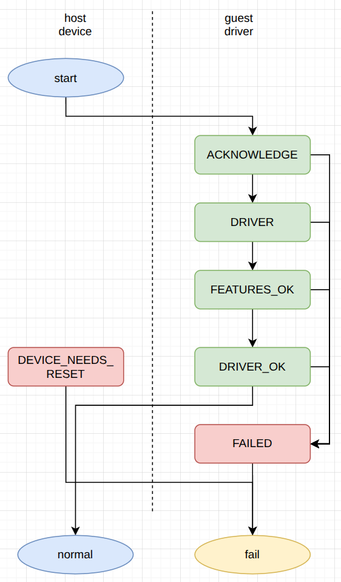
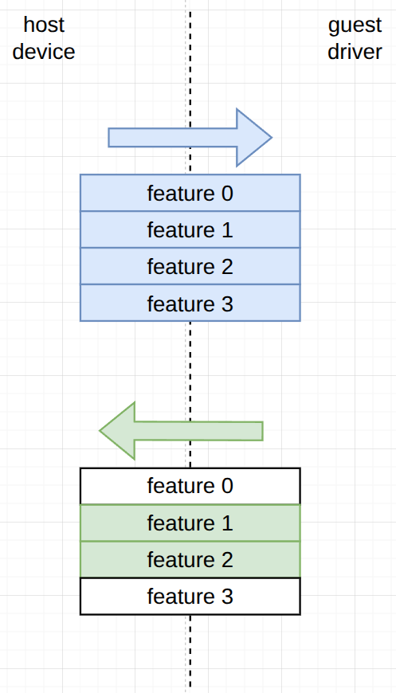
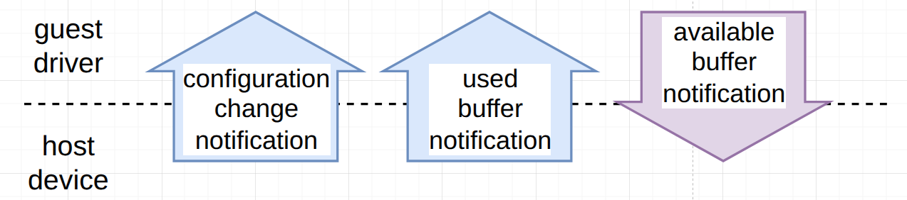
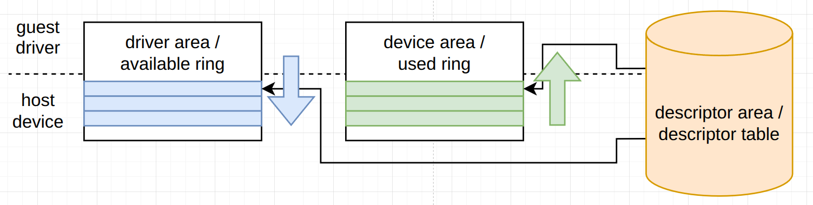
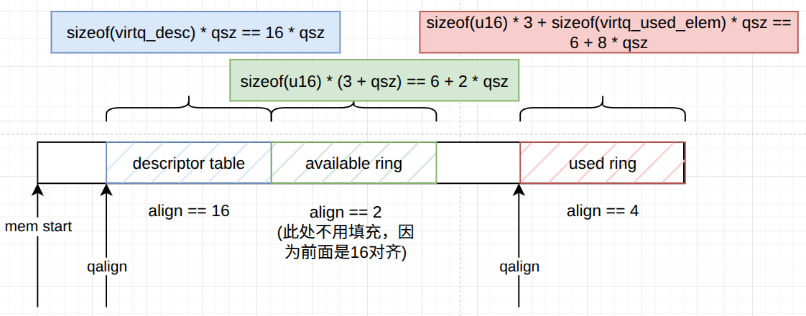

# 2 virtio 设备的基本设施
- virtio 设备是通过总线特定的方法被发现并识别的（请参阅总线章节：4.1 virtio 在 PCI 总线上的实现、4.2 virtio 在 MMIO 上的实现以及 4.3 Virtio 在通道 I/O 上的实现）。每个设备都包含以下部分：
- 1. 设备状态字段
- 2. 特性位
- 3. 通知
- 4. 设备配置空间
- 5. 1 个或多个 virtqueue

## 2.1 设备状态字段
- 在设备被驱动初始化期间，驱动遵循 3.1 章节中规定的步骤。
- *设备状态*字段能以一种简单直观的方式，对这一序列中，已完成的步骤进行标示。最直观的理解方式，是将其想象成与控制台上的信号灯相连，从而能显示每个设备的状态。定义了以下标志位（按照它们通常出现的顺序列出）：
- 1. **ACKNOWLEDGE** (1) 表示客户机操作系统已找到该设备，并将其识别为有效的 virtio 设备。
- 2. **DRIVER** (2) 表示客户机操作系统知晓如何驱动该设备。注意：设置此位可能会有较长（或无限）的延迟时间。例如，在 Linux 系统下，驱动可以是可加载模块。
- 3. **FAILED** (128) 表示在客户机中出现了错误，并且它已放弃该设备。这可能是内部错误，或者驱动由于某种原因不接受该设备，甚至在设备运行过程中出现致命错误。
- 4. **FEATURES_OK** (8) 表示驱动已确认其能够理解的所有功能，并且功能协商已完成。
- 5. **DRIVER_OK** (4) 表示驱动已设置完，并准备驱动该设备。
- 6. **DEVICE_NEEDS_RESET** (64) 表示设备已出现错误且无法自行恢复。
- *设备状态*字段初始值为 0，在设备重置时会重新初始化为 0。



### 2.1.1 驱动要求：设备状态字段
- 驱动**必须**更新*设备状态*，设置位标志来指示：章节 3.1 中规定的驱动初始化流程中已完成的步骤。驱动**禁止**清理*设备状态*位。如果驱动设置了 FAILED 位，驱动**必须**在试图重新初始化前，重置该设备。
- 在 DEVICE_NEEDS_RESET 标志位有效时，驱动**不应该**依赖于设备去完成操作。
- **注意**：例如，在 DEVICE_NEEDS_RESET 被设置的情况下，驱动不能假定执行中的请求能够被完成，也不能假定这些请求尚未完成。比较好的方式是，尝试通过发出重置指令来进行恢复。

### 2.1.2 设备要求：设备状态字段
- 在 DRIVER_OK 状态有效前，设备**禁止**消耗任何缓冲区数据，或者发送任何已使用缓冲区通知给驱动。
- 当进入错误状态，并且需要重置时，设备**应该**设置 DEVICE_NEEDS_RESET 位。如果设备设置过 DEVICE_NEEDS_RESET，然后又设置了 DRIVER_OK 位，设备**必须**发送一个设备配置更改通知给驱动。

## 2.2 特性位
- 每个 virtio 设备都会提供其能够理解的所有功能。在设备初始化过程中，驱动会读取这些信息，并告知该设备其接受的功能子集。重新协商的唯一方式是重置设备。

- 这种方式，实现了向前兼容和向后兼容：如果设备新增了某个新功能位，较老的驱动不会将该功能位写回给设备。同样，如果某个驱动新增了设备不支持的功能，驱动也不会看到这些新功能被设备提供出来。
- 特性位的分配如下：
- 1. **[0, 23] & [50, 127]** 特定设备类型的功能位
- 2. **[24, 41]** 预留给队列和功能协商机制的拓展功能位
- 3. **[42, 49] & 128+** 预留给未来扩展的功能位
- **注意**：例如，网络设备（即设备 ID 1）的特性位 0，表示该设备支持数据包校验和。
- 特别是，设备配置空间中的新字段通过提供一个新的特征位来表示。
- 为了使功能协商机制具有可扩展性，至关重要的是，设备*不提供任何它们在驱动接受这些功能时无法处理的功能位（尽管根据规范，驱动不应接受任何未明确说明、保留或不支持的功能，即便这些功能被提供出来也是如此）*。 [设备不提供任何，驱动能够处理，但是设备本身无法处理的特性]
- 同样重要的是，驱动不应接受它们不知道如何处理的特性（尽管设备最初不应提供任何未明确说明、保留或不支持的特性，根据规范也是如此）。处理保留和意外特性的首选方式是让驱动忽略它们。
- 特别是，这对于仅限于特定传输方式的特性尤为重要，因为在规范的未来版本中为更多传输方式启用这些特性，极有可能需要改变驱动和设备的行为。支持多种传输方式的驱动和设备需要仔细维护每个传输方式的允许特性列表。

### 2.2.1 驱动要求：特性位
- 驱动**禁止**接受设备未提供的特性，也**禁止**接受这样一个特性：它依赖于其他未被接受的特性。
- 驱动**必须**验证设备所提供的特性位。驱动**必须**忽略，并**禁止**接受以下特性位：
- 1. 未在本规范中描述的，
- 2. 标记为保留的，
- 3. 特定传输方式下不支持的，
- 4. 当前设备类型下未定义的。
- 如果设备未提供其能够理解的特性，驱动**应该**进入向后兼容模式，否则**必须**设置 FAILED *设备状态*并停止初始化。
- 相比之下，驱动**禁止**仅仅因为设备提供了它不理解的功能而失败。

### 2.2.2 设备要求：特性位
- 设备**禁止**提供这样一种特性，该特性依赖于未被提供的其他特性。设备**应该**接受驱动所支持的任何有效特性的子集，否则在驱动写入有效特性时，设备**必须**在设置 FEATURES_OK *设备状态*位时报错。
- 如果驱动支持某些特性位（即使规范禁止驱动接受这些特性），但是设备本身又不支持，那么它**禁止**提供这些特性位；为了清晰起见，这里指的是本规范中未描述的特性位，保留的特性位，以及针对特定传输或特定设备类型被保留或不支持的特性位，但是，这一规定并不排除按照此规范的未来版本编写设备时，如果该规范对设备支持相应功能有所规定，那么这些设备可以提供此类功能位。
- 如果设备至少成功协商过一组功能（通过在设备初始化期间接受 FEATURES_OK *设备状态*位），那么，在设备或系统重置后，它**不应该**拒绝对相同组功能的重新协商。否则，这将干扰从休眠状态恢复的操作和错误恢复。

### 2.2.3 传统接口：特性位注意事项
- 过渡性驱动**必须**通过侦测 VIRTIO_F_VERSION_1 特性位未被提供，来识别传统设备。过渡性设备**必须**通过侦测驱动未确认 VIRTIO_F_VERSION_1 来识别传统驱动。
- 在这种情况下，[驱动] 将通过传统接口来调用设备。
- 传统接口支持是**可选**的。因此，过渡性和非过渡性的设备和驱动都遵守本规范。
- 过渡性设备和驱动相关的要求，包含在名为“传统接口”的章节中，就像这一节一样。
- 当通过传统接口使用设备时，过渡性设备和驱动**必须**按照这些传统接口章节中写明的要求运行。这些章节内的规范文本通常不适用于非过渡型设备。

## 2.3 通知
- 发送通知（设备至驱动，或者相反）这一概念在本规范中起着重要作用。通知的方式取决于传输协议。
- 通知有三种类型：
- 1. 配置更改通知
- 2. 可用缓冲区通知
- 3. 已使用缓冲区通知。
- 配置更改通知和已使用缓冲区通知由设备发送，接收方是驱动。配置更改通知表示设备的配置空间发生了变化；已使用缓冲区通知，表示已将缓冲区用于 virtqueue（该队列由通知指定）。
- 可用缓冲区通知由驱动发送，接收方是设备。这种类型的通知，表示已将缓冲区在virtqueue（该队列由通知指定）上启用。

- 不同通知的语义，传输特定的实现方式，以及其他重要方面在后续章节中进行了详细说明。
- 大多数传输协议，使用中断来实现从设备到驱动的通知发送。因此，在本规范的先前版本中，这些通知通常被称为中断。本规范中定义的一些名称仍保留了这种中断的术语。有时，术语*事件*也被用来指代通知或收到的通知。

## 2.4 设备重置
- 驱动可能在不同时间需要重置设备；特别地，在设备初始化和清理过程中需要进行此操作。
- 驱动用于启动重置的机制是与传输方式相关的。

### 2.4.1 设备要求：设备重置
- 在接受到重置指令后，设备**必须**将*设备状态*清零。
- 在表明重置已完成（通过将*设备状态*重置为 0）之后，设备**禁止**发送通知或与队列进行交互，直到驱动再次初始化该设备。

### 2.4.2 驱动要求：设备重置
- 在读取到*设备状态*为 0 时，驱动**应该**判定驱动重置[设备]的操作完成。

## 2.5 设备配置空间
- 设备配置空间，通常用于那些不易变动或在初始化时设置的参数。在配置字段为可选的情况下，其是否存在通过特征位来表示：本规范的未来版本，可能会通过在尾部添加额外字段，来扩展设备配置空间。
- **注意**：设备配置空间使用小端格式来表示多字节字段。
- 每个传输还为设备配置空间提供了一个生成计数，每当有可能对设备配置空间进行两次访问，并看到该空间的不同版本时，该计数就会发生变化。

### 2.5.1 驱动要求：设备配置空间
- 驱动**禁止**假定，对宽度超过 32 位的字段的读取操作是原子性的，同样，对多个字段的读取操作也是如此：驱动**应该**像下面这样读取设备配置空间中的字段：
```c
u32 before, after;
do {
    before = get_config_generation(device);
    // read config entry/entries.
    after = get_config_generation(device);
} while (after != before);
```
- 对于可选的配置空间字段，在驱动访问到这部分的配置空间前，**必须**检测对应的特性是否[由设备]支持。
- 注意：参考章节 3.1 了解更多的特性协商细节。
- 驱动**禁止**限制结构体的大小和设备配置空间的大小。相反，驱动**应该**仅检查设备配置空间是否*足够大*，以能够容纳设备运行所需的字段。
- **注意**：例如，如果本规范指出设备配置空间“包含一个 8 比特字段”，那么驱动应当意识到，设备配置空间还可能包含任意长度的尾部填充，并接受任何等于或大于指定的 8 比特大小的设备配置空间。

### 2.5.2 设备要求：设备配置空间
- 在驱动设置 FEATURES_OK 标志之前，设备**必须**能够读取任何设备特定的配置字段。这些字段，包括那些取决于功能位的字段，只要这些功能位是由该设备提供的即可。

### 2.5.3 传统接口：设备配置空间字节序注意事项
- 请注意，对于传统接口而言，设备配置空间通常采用的是客户机的原生字节序，而非 PCI 的小端字节序。每个设备的正确字节序都有相应的文档说明。

### 2.5.4 传统接口：设备配置空间
- 传统设备没有配置生成字段，因此，如果配置发生更新就容易出现竞争场景。这会影响到块设备*容量*（见 5.2.4 节）和网络设备 *mac*（见 5.1.4 节）字段；在使用传统接口时，驱动**应该**多次读取这些字段，直到两次读取产生一致的结果。

## 2.6 virtqueue
- 在虚拟机设备上进行大量数据传输的机制，叫做 virtqueue。每个设备可以拥有 0 个或多个 virtqueue。
- virtio 设备最多可以有 65536 个 virtqueue。每个 virtqueue 都通过一个 virtqueue 索引来标识。virtqueue 索引的值在 0 到 65535 之间。
- 驱动通过向队列中添加可用缓冲区来向设备提供请求，即向 virtqueue 添加描述请求的缓冲区，并可选择触发驱动事件，即向设备发送可用缓冲区通知。
- 设备执行这些请求，并在完成时向队列中添加已使用缓冲区，即通过将缓冲区标记为已使用来通知驱动。设备可以触发设备事件，即向驱动发送已使用缓冲区通知。
- 设备会报告，它为每个使用的缓冲区写入到内存中的字节数。这被称为“已使用长度”。
- 设备通常不需要，按照驱动提供的顺序使用缓冲区。
- 有些设备，总是按照驱动提供的顺序使用描述符。这些设备可以报告 VIRTIO_F_IN_ORDER 特性。如果协商成功，这个特性或许能够实现优化，或者简化驱动和/或设备代码。
- 每个 virtqueue 可以包含最多 3 个部分：
- 1. 描述符区域 - 用于描述缓冲区
- 2. 驱动区域 - 驱动向设备提供的额外数据
- 3. 设备区域 - 设备向驱动提供的额外数据
- **注意**：本协议的之前版本中，给这 3 个部分取了不同的名字（参照章节 2.7）：
- 1. 描述符表 - 等同于描述符区域
- 2. 可用环形缓冲区 - 等同于驱动区域
- 3. 已使用环形缓冲区 - 等同于设备区域
- 以下 2 种格式可供选择：分散式 virtqueue（参考 2.7 分散式 virtqueue）和整合式 virtqueue（参考 2.8 整合式 virtqueue）。
- 任一驱动和设备，要么支持整合式 virtqueue 格式，要么支持分散式 virtqueue 格式，或者两者都支持。

### 2.6.1 virtqueue 重置
- 当[驱动和设备]协商过 VIRTIO_F_RING_RESET 特性，驱动可以自己重置 virtqueue。重置 virtqueue 的方法，是和传输方式相关的。
- virtqueue 的重置分为 2 个部分。驱动首先会重置一个队列，之后用户可以选择重新启用该队列。

#### 2.6.1.1 virtqueue 重置

##### 2.6.1.1.1 设备要求：virtqueue 重置
- 在驱动重置完队列后，设备**禁止**再从该 virtqueue 中执行任何请求，或者向驱动通知任何关于该队列的消息。
- 设备**必须**将该 virtqueue 相关的任何状态重置成默认状态，包含已经标记为有效或者使用过的状态。

##### 2.6.1.1.2 驱动要求：virtqueue 重置
- 在驱动通知设备要去重置一个队列之后，驱动**必须**验证该队列是否真的被重置了。
- 在队列被成功重置后，驱动**可以**释放任何和该 virtqueue 绑定的资源。

#### 2.6.1.2 virtqueue 重新使能
- 该过程，和初始化整个设备时，对于单个队列的初始化过程相同。

##### 2.6.1.2.1 设备要求：virtqueue 重新使能
- 设备**必须**遵循由驱动所限定的任何队列配置，例如最大队列大小。
##### 2.6.1.2.2 驱动程序要求：virtqueue 重新使能
- 在重新启用队列时，驱动**必须**按照，初始化 virtqueue 过程中，发现的配置来配置队列资源，但可以使用不同的参数（可选）。

## 2.7 分散式 virtqueue
- 分散式 virtqueue 格式，是本协议 1.0 版本（和更老版本）支持的唯一格式。
- 分散式 virtqueue 格式，将 virtqueue 拆分成多个部分，其中每一部分均可由驱动或设备中的任意一方进行写入操作，但两者不能同时操作。在标记缓冲区可用，以及标记缓冲区已使用时，需要更新多个 [分散式 virtqueue 的] 部分，（以及/或者）部分内部的某些位置。
- 每个队列拥有 16 比特的队列大小参数，该参数设置 [队列的] 入口数量，并且表明队列的整体大小。
- 每个 virtqueue 包含以下 3 个部分：
- 1. 描述符表 - 存在于描述符区域
- 2. 可用环形缓冲区 - 存在于驱动区域
- 3. 已使用环形缓冲区 - 存在于设备区域
- 其中，每个部分在客户机内存中都是物理连续的，并且有不同的内存对齐要求。
- 内存对齐和大小要求，是用字节数来表示的，virtqueue 的每个部分的要求总结在下表中：

| virtqueue 部分 | 对齐 | 大小 |
| ---- | ---- | ---- |
| 描述符表 | 16 | 16∗(队列大小) |
| 可用环形缓冲区 | 2 | 6 + 2*(队列大小) |
| 已使用环形缓冲区 | 4 | 6 + 8*(队列大小) |

- **对齐**这一列，给出了 virtqueue 每个部分的最小对齐要求。
- **大小**这一列，给出了 virtqueue 每个部分总的字节数。
- **队列大小**对应 virtqueue 缓冲区的最大数量。**队列大小**的值总是 2^n。**队列大小**的最大值是 32768。
- 当驱动想要向设备发送一个缓冲区时，它会在描述符表中的一个条目填入数据（或者将多个描述符串联起来），并将描述符索引写入可用环形缓冲区中。然后驱动会通知设备。当设备完成一个数据缓冲区的处理后，它会将描述符索引写入已使用环形缓冲区中，并发送一个已使用缓冲区通知。



### 2.7.1 驱动要求：virtqueue
- 驱动**必须**确保，每个 virtqueue 部分的第一个字节的物理地址，必须是上述表格中指定对齐值的倍数。

### 2.7.2 传统接口：virtqueue 布局注意事项
- 对于传统接口，对 virtqueue 的布局还设置了若干额外的限制：
- 每个 virtqueue 占用 2 个或更多物理连续的页面（通常定义为 4096 字节，但具体取决于传输方式；此后统称为**队列对齐**） [一般 CPU 访问内存都是 4 KB 对齐的，这里的 4096 字节应该是这么来的，能够它提高效率] 并由 3 个部分组成：

- | 描述符表 | 可用环形缓冲区（...填充...） | 已使用环形缓冲区 |
- 总线特定的**队列大小**字段，控制着 virtqueue 的总字节数。当使用传统接口时，过渡驱动**必须**从设备中获取**队列大小**字段，并且**必须**根据以下公式（qalign 给定**队列对齐**，qsz 给定**队列大小**）为 virtqueue 分配总字节数：
```c
#define ALIGN(x) (((x) + qalign) & ~qalign)
static inline unsigned virtq_size(unsigned int qsz)
{
    return ALIGN(sizeof(struct virtq_desc)*qsz + sizeof(u16)*(3 + qsz))
        + ALIGN(sizeof(u16)*3 + sizeof(struct virtq_used_elem)*qsz);
}
```



- 由于字节填充的原因，会浪费一些内存空间。当使用传统接口时，过渡性设备和驱动都**必须**使用以下的virtqueue结构体，来放置virtqueue的成员：
```c
struct virtq {
    // The actual descriptors (16 bytes each)
    struct virtq_desc desc[ Queue Size ];

    // A ring of available descriptor heads with free-running index.
    struct virtq_avail avail;

    // Padding to the next Queue Align boundary.
    u8 pad[ Padding ];

    // A ring of used descriptor heads with free-running index.
    struct virtq_used used;
}
```

### 2.7.3 传统接口：virtqueue 字节序注意事项
- 需要注意的是，当使用传统接口时，过渡性的设备和驱动**必须**使用客户机原生的字节序，作为各个 [特性] 字段和 virtqueue 的字节序。这与本协议所规定的，非传统接口的小端字节序相反。默认主机已经知晓客户机的字节序。

### 2.7.4 消息帧封装
- 使用描述符的消息帧封装，与缓冲区的内容无关。例如，一个网络传输缓冲区由一个 12 字节的头部和网络数据包组成。这种结构可以简单地放在描述符表中，即先是一个 12 字节的输出描述符，然后是一个 1514 字节的输出描述符，但在某些情况下，如果头部和数据包相邻，也可以是一个 1526 字节的输出描述符，甚至可能是 3 个或更多的描述符（在这种情况下可能会降低效率）。
- 请注意，一些设备实现，对描述符的总大小有较大的但合理的限制（例如基于主机操作系统的 IOV_MAX）。但在实际应用中，这并不是一个问题：不会对创建不合理大小描述符（例如将网络数据包分割成 1500 个单字节描述符）的驱动给予太多侧重！

#### 2.7.4.1 设备要求：消息帧封装
- 设备**禁止**对描述符的具体排列方式做出任何假设。设备**可以**设定一个合理的限制值，即它在一个链中所能允许使用的描述符数量。

#### 2.7.4.2 驱动要求：消息帧封装
- 驱动**必须**将任何设备可写的描述符元素，放置在任一设备可读的描述符元素后面。
- 驱动去描述一个数据缓冲区时，**不应该**不应该使用超出限定数量的描述符。

#### 2.7.4.3 传统接口：消息帧封装
- 遗憾的是，最初的驱动实现采用了简单的布局方式，而设备也依赖于这种布局方式，尽管本规范中并未明确说明这一点。此外，virtio_blk SCSI 命令的规范，要求从帧边界来推断字段长度（见 5.2.6.3 传统接口：设备操作）。
- 因此，在使用传统接口时，VIRTIO_F_ANY_LAYOUT 特性向设备和驱动表明，对于帧结构没有做出任何假设。当未进行此协商时，过渡性驱动的要求包含在每个设备部分中。

### 2.7.5 virtqueue 描述符表
- 描述符表指的是驱动为设备所使用的缓冲区。*addr* 是一个物理地址，这些缓冲区可以通过 *next* 进行链接。每个描述符描述一个缓冲区，对于设备而言，该缓冲区是只读的（“设备可读”）或只写的（“设备可写”），但描述符链表可以同时包含，设备可读和设备可写的缓冲区。
- 提供给设备的实际内存内容取决于设备类型。最常见的做法是数据以一个头信息（包含小端格式字段）开始，供设备读取，然后以一个状态尾部信息结尾，供设备写入。
```c
struct virtq_desc {
    /* Address (guest-physical). */
    le64 addr;
    /* Length. */
    le32 len;

/* This marks a buffer as continuing via the next field. */
#define VIRTQ_DESC_F_NEXT 1
/* This marks a buffer as device write-only (otherwise device read-only). */
#define VIRTQ_DESC_F_WRITE 2
/* This means the buffer contains a list of buffer descriptors. */
#define VIRTQ_DESC_F_INDIRECT 4
    /* The flags as indicated above. */
    le16 flags;
    /* Next field if flags & NEXT */
    le16 next;
};
```
- [描述符]表中描述符的数量，是通过该 virtqueue 的队列大小来定义的：这是描述符链表长度可能的最大值。
- 如果[驱动和设备]协商过 VIRTIO_F_IN_ORDER 特性，驱动在环形缓冲区中使用描述符时遵循：从表的 0 偏移处起始，在表的尾部再折返到头部。
- **注意**：传统协议[Virtio PCI 草案]将此结构称为 vring_desc，并将相关常量称为 VRING_DESC_F_NEXT 等，但其布局和值是完全相同的。

#### 2.7.5.1 设备要求：virtqueue 描述符表
- 设备**禁止**向设备可读的缓冲区写入，并且设备**不应该**读取设备可写的缓冲区（如果为了调试或者分析的目的**可以**这样做）。设备**禁止**向任何描述符表条目写入。

#### 2.7.5.2 驱动要求：virtqueue 描述符表
- 驱动**必须**确保描述符链的总长度不超过 2^32 字节；这意味着描述符链表禁止做成循环结构！
- 如果已协商了 VIRTIO_F_IN_ORDER 标志，并且在表中（该表可供设备使用）的偏移 *x* 处设置了 VRING_DESC_F_NEXT 标志来创建描述符时，驱动**必须**将表中的最后一个描述符的 *next* 字段设置为 0（其中 *x = queue_size - 1*），并将其余描述符的 *next* 字段设置为 *x + 1*。

#### 2.7.5.3 间接描述符
- 某些设备通过同时处理大量大型请求而受益。VIRTIO_F_INDIRECT_DESC 特性支持这一功能（请参阅 A virtio_queue.h）。为了增加环形缓冲区的容量，驱动可以在内存中的任何位置存储一个间接描述符表，并在核心 virtqueue 中插入一个描述符（使用标志 VIRTQ_DESC_F_INDIRECT），该描述符指向包含此间接描述符表的内存缓冲区；*addr* 和 *len* 分别表示间接表的地址和字节数。
- 间接表的布局结构如下（*len* 是指向此表的描述符的长度，这是一个变量，所以这段代码不会编译）：
```c
struct indirect_descriptor_table {
    /* The actual descriptors (16 bytes each) */
    struct virtq_desc desc[len / 16];
};
```

- 首个间接描述符，位于间接描述符表的起始位置（索引为 0），更多的间接描述符通过 *next* 参数组织成链表结构。*next* 参数无效（flags 中 VIRTQ_DESC_F_NEXT 位无效）的间接描述符，表示描述符链表的尾部。间接描述符表，可以同时包含设备可读和设备可写的描述符。
- 如果[驱动和设备]协商过 VIRTIO_F_IN_ORDER 特性，间接描述符可以使用有序索引，遵循：索引 0 后面跟着索引 1，然后再跟着索引 2，以此类推。

##### 2.7.5.3.1 驱动要求：间接描述符
- 除非协商过 VIRTIO_F_INDIRECT_DESC 特性，否则驱动**禁止**设置 VIRTQ_DESC_F_INDIRECT 标志。在间接描述符中，驱动**禁止**设置 VIRTQ_DESC_F_INDIRECT [禁止套娃]。
- 驱动**禁止**创建长度超过设备**队列大小**的描述符链表。
- 驱动**禁止**在 flags 中同时设置 VIRTQ_DESC_F_INDIRECT 和 VIRTQ_DESC_F_NEXT 特性。
- 如果未协商 VIRTIO_F_IN_ORDER 特性，间接描述符**必须**按照次序排列，并且第 1 个描述符 [idx == 0]的 *next* 值设为 1，第 2 个描述符 [idx == 1] 设为 2，以此类推。

##### 2.7.5.3.2 设备要求：间接描述符
- 设备**必须**忽略描述符中的只写标志（flags&VIRTQ_DESC_F_WRITE）这一项，该标志所指的描述符是针对间接表的。
- 设备**必须**处理以下情况：0 个或多个常规链式描述符，随后是 1 个带有 flags & VIRTQ_DESC_F_INDIRECT 的单个描述符。
- **注意**：虽然这种情况较为罕见（大多数实现,要么仅使用非间接描述符来创建链表，要么使用单个间接元素），但这种布局是合规的。

### 2.7.6 virtqueue 可用环形缓冲区
- 可用环形缓冲区具有以下结构体布局：
```c
struct virtq_avail {
#define VIRTQ_AVAIL_F_NO_INTERRUPT 1
    le16 flags;
    le16 idx;
    le16 ring[ /* Queue Size */ ];
    le16 used_event; /* Only if VIRTIO_F_EVENT_IDX */
};
```
- 驱动使用可用环形缓冲区，来向设备提供数据缓冲区：每个环形缓冲区条目，指向描述符链表的头部。该环形缓冲区，只能由驱动来写，设备来读。
- idx 字段，表示驱动将在环形缓冲区中，将下一个描述符条目放置在何处（取模于队列大小）。
- 该值从 0 开始递增。
- **注意**：传统协议[Virtio PCI Draft]将这个结构体称为 vring_avail，并且将这个常量[上文代码中的 VIRTQ_AVAIL_F_NO_INTERRUPT]称为 VRING_AVAIL_F_NO_INTERRUPT，但是结构体排布和取值都是一样的。

#### 2.7.6.1 驱动要求：virtqueue的可用环形缓冲区
- 驱动**禁止**递减virtqueue上的可用 idx 值（就是说，暴露[给设备]的缓冲区无法撤回）。

### 2.7.7 已使用缓冲区提示抑制

#### 驱动要求：已使用缓冲区提示抑制

#### 设备要求：已使用缓冲区提示抑制

### 2.7.8 virtqueue已使用环形缓冲区

#### 2.7.8.1 传统接口：virtqueue已使用环形缓冲区

#### 2.7.8.2 设备要求：virtqueue已使用环形缓冲区

#### 2.7.8.3 驱动要求：virtqueue已使用环形缓冲区

### 2.7.9 按序使用描述符
- 一些设备通常按照描述符生成的顺序使用它们。这些设备能够声明 VIRTIO_F_IN_ORDER 特性。如果该特性[在驱动和设备之间]协商成功，那么设备在通知驱动批量缓冲区的使用情况时，只用填写一个已使用环形缓冲区条目，并把描述符链表的头部条目对应的 id 填在其中。
- 然后设备根据批量缓冲区的长度直接跳过。相应的，设备也会根据批量缓冲区的大小，更改已使用 idx 的大小。
- 驱动需要查看已使用 id，并且计算出批量缓冲区的大小，以便能够抵达下一个设备将要填写的已使用环形缓冲区位置。
- 这将导致已使用环形缓冲区条目，在位置上与批次中的首个可用环形缓冲区条目相匹配，下一个批次的已使用环形缓冲区条目，在位置上与下一个批次中的第一个可用环形缓冲区条目相匹配，依此类推。
- 未使用的缓冲区（未写入已使用环形缓冲区条目的部分）则假定已被设备完全使用（读取或写入）。

### 2.7.10 可使用缓冲区通知抑制

#### 2.7.10.1 驱动要求：可用缓冲区通知抑制

#### 2.7.10.2 设备要求：可用缓冲区通知抑制

### 2.7.11 操作virtqueue的辅助工具
- Linux内核源码中，在 include/uapi/linux/virtio_ring.h 中包含了上述定义，并且提供了更易于使用的辅助例程。这部分代码由 IBM 和 Red Hat 在 BSD 许可证下授权，因此可以在其他项目中自由使用，并且这些代码在 virtio_queue.h 中也重新实现了一份（做了细微改动）。

### 2.7.12 virtqueue操作
- virtqueue操作分为两块：[驱动]为设备提供新的可用缓冲区，以及[设备]处理已使用缓冲区。

- **注意**：举例来说，最简单的虚拟 I/O 网络设备包含 2 个virtqueue：发送virtqueue和接收virtqueue。驱动向发送virtqueue添加数据包（设备可读），并且在用完后清理掉这些数据包。同样的，接收到的数据包（设备可写）会被添加到接收virtqueue中，并且等待处理。
- 接下来详细描述，这 2 块操作如何使用分散式virtqueue。

### 2.7.13 向设备提供缓冲区
- 驱动按照以下步骤，向 device 的 virtqueue 提供缓冲区：
- 1. 驱动将缓冲区放置在描述符表的空闲描述符中，并按照需要的方式组织成一个链表（详见 2.7.5 virtqueue描述符表）。
- 2. 驱动找到 available ring 中的下一个 ring entry，并将描述符链表的头部索引填写进去。
- 3. 如果要填写的是批量的缓冲区，上述步骤 1 和 2 可能需要重复操作。
- 4. 驱动执行适当的内存屏障（Alano：常见的内存保护手段，保证 driver 和 device 端的读写一致），来保证 device 在下一步操作之前，能看到更新过的 descriptor table 和 available ring。
- 5. available idx 会随着添加到 available ring 中的描述符链表头的数量增加而增加。
- 6. 驱动执行适当的内存屏障，来确保它自己能够在检查 notification suppression 之前，成功更新 idx 域。
- 7. 如果（驱动和设备之间）未禁用 available 缓冲区 notification，那么 driver 会向 device 发送一个这样的 notification 。
- 需要注意的是：上述步骤没有对 available ring 缓冲区的溢出覆盖异常采取预防手段：这种情况应该不会发生，因为 ring 缓冲区的大小和 descriptor table 的大小一直，所以上述步骤（1）就能够防止这种异常发生。
- 另外：最大的 queue size 是 32768（16 bit 数据里面，最大的 2 的 n 次幂）（Alano：2^15）。
- 接下来详细说说，上述的每一个步骤有什么要求。

#### 2.7.13.1 将缓冲区添加到 descriptor table 中

#### 2.7.13.2 更新 available ring

#### 2.7.13.3 更新 idx

##### 2.7.13.3.1 更新 idx 对 driver 有什么要求

#### 2.7.13.4 （driver）通知 device

##### 2.7.13.4.1 （driver）通知 device，对 driver 有什么要求

### 2.7.14 （driver）从 device 接收 used 缓冲区

- 一旦 device 处理完 descriptor 描述的缓冲区数据后，device 会按照章节 2.7.7 中描述的方式，发送一个 used 缓冲区 notification。
- 注意：出于性能考虑，处理 used 缓冲区 ring时，driver *也许* 会禁用 used 缓冲区 notification。但同时我们也要注意到，在清空 ring 和重新使能 notification 的间隙，可能会出现 norification 丢失的问题。这个问题可以通过，在重新启用 notification 后，重新检查 used 缓冲区的方式来解决：

```c
virtq_disable_used_buffer_notifications(vq);
for (;;) {
    if (vq->last_seen_used != le16_to_cpu(virtq->used.idx)) {
        virtq_enable_used_buffer_notifications(vq);
        mb();

        if (vq->last_seen_used != le16_to_cpu(virtq->used.idx))
            break;

        virtq_disable_used_buffer_notifications(vq);
    }

    struct virtq_used_elem *e = virtq.used->ring[vq->last_seen_used%vsz];
    process_buffer(e);
    vq->last_seen_used++;
}
```

## 2.8 packed virtqueue

- packed virtqueue 是一个可选的布局紧凑型 virtqueue，并且使用可读可写内存（即内存可以同时被 host 和 guest 读和写）。
- 要想使用 packed virtqueue 功能，需要（Alano：driver 和 device）协商 VIRTIO_F_RING_PACKED 特性标志位。
- 每个 packed virtqueue 支持高达 2^15 个 entires。
- 根据当前（Alano：协议规定的）传输方式，virtqueue 被放置在 driver 分配的 guest memory 中。每个 packed virtqueue 包含 3 部分：
- 1. descriptor ring - 位于 descriptor area 中
- 2. driver event suppression - 位于 driver area 中
- 3. device event suppression - 位于 device area 中

- descriptor ring 包含多个描述符，并且每个描述符可能包含以下部分：
- 1. Buffer ID
- 2. Element Address
- 3. Element Length
- 4. Flags

- 缓冲区包含 0 个或者更多的 device 可读的，物理连续（Alano：就是物理地址连续）的元素，并且这些元素后面紧跟着 0 个或者更多的物理连续的 device 可写的元素。（每个缓冲区至少包含一个元素）
- 当 driver 想把这样一个缓冲区发送给 device 的时候，driver 会向 descriptor ring 中，写入至少 1 个 available descriptor，这个 descriptor 会填写该缓冲区的描述元素。这个 descriptor 会通过自己保存 Buffer ID 的方式，将自己和对应的缓冲区绑定在一起。
- 然后 driver 会通知 device。当处理完这个缓冲区之后，device 会向 descriptor ring 中写入 1 个 used device descriptor，并把 Buffer ID 填进这个 descriptor 中，然后再发送一个 used event notification。
- descriptor ring 通过回环的方式工作：driver 按次序写入 descriptor。在写到 ring 的尾部之后，下一个 descriptor 又被写到 ring 的头部。一旦 ring 被写满了，driver 就停止发送新的请求，然后等待 device 处理 descriptor，并把 descriptor 标记成 used 状态，driver 就又能获得新的 descriptor 使用。
- 同样的，device 按顺序从 ring 中读取 descriptor，同时侦测 descriptor 是否被标记成 available 状态。等处理完 descriptor 之后，device 又会将 used descriptor 写回到 ring 中。
- 注意：在 device 读取到 driver 提供的 descriptor时，device 可能不会按原来的顺序处理这些 descriptor。当 device 写 used descriptor 时，它会严格按照自己完成的顺序去写。

### 2.8.1 driver & device ring 计数器
- driver 和 device 都会在内部维护一个 single-bit 计数器，该计数器初始值会被设置成 1。
- 其中 driver 维护的计数器叫做 driver ring wrap counter。每次 driver 将 ring 中的 descriptor 标记为 available 状态时，都会去更新这个计数器的值。
- device 维护的计数器叫做 device ring wrap counter。每次 device 用完 ring 中的 descriptor 时，都会去更新这个计数器的值。
- 当 driver 和 device 在处理同一个 descriptor 时，或者所有的 available descriptor 都被用完时，我们能看到 driver 和 device 各自的 ring wrap counter 能够匹配上。
- 如果想标记 descriptor 为 available 或者 used 状态，driver 和 device 同时需要使用以下标志位：
```c
#define VIRTQ_DESC_F_AVAIL (1 << 7)
#define VIRTQ_DESC_F_USED (1 << 15)
```
- 要把 descriptor 标记为 available 状态，driver 需要根据内部维护的 driver ring wrap counter，设置 Flags 中的 VIRTQ_DESC_F_AVAIL 位。
- 要把 descriptor 标记为 used 状态，device 需要根据内部的 device ring wrap counter，设置 Flags 中的 VIRTQ_DESC_F_USED 位。
- 因此 VIRTQ_DESC_F_AVAIL 和 VIRTQ_DESC_F_USED 位，对于 available descriptor 来说值是不同的，对于 used descriptor 来说值是相同的。
- 要注意，以上情形通常用于合理性检查，因为这些条件是必要的，但是不是充分条件 - 例如，所有的 descriptor 初始化时没有清零。为了侦测 used 和 available descriptor，driver 和 device 持续跟踪最后一个已发现的 VIRTQ_DESC_F_USED / VIRTQ_DESC_F_AVAIL 的值，是很有必要的。也可以用其他的方法去探测 VIRTQ_DESC_F_USED / VIRTQ_DESC_F_AVAIL 位。

### 2.8.2 轮询 available 和 used descriptor